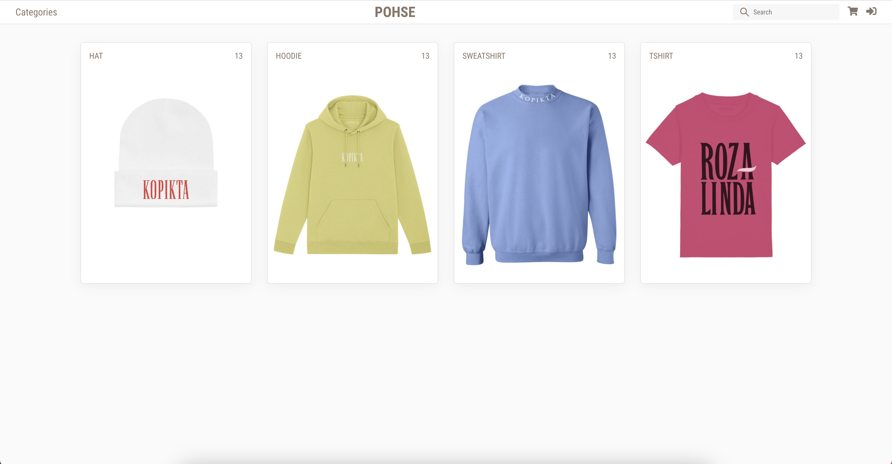
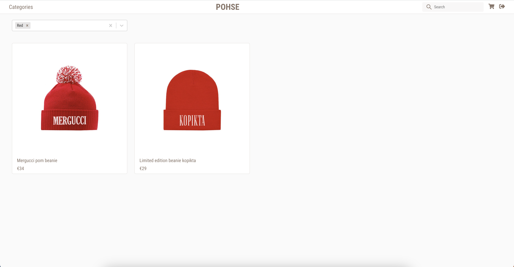
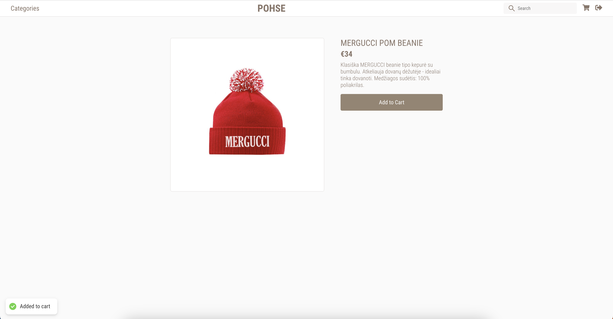
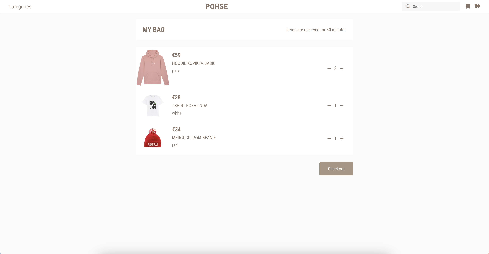
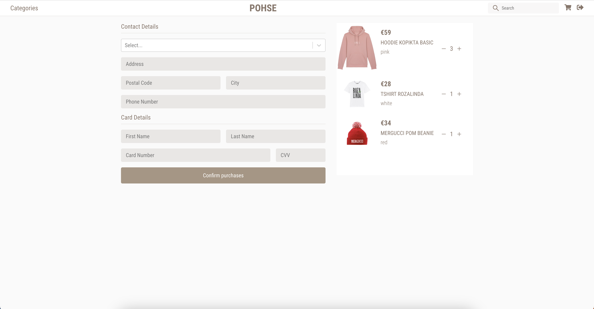
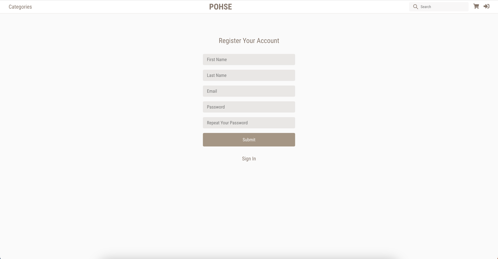
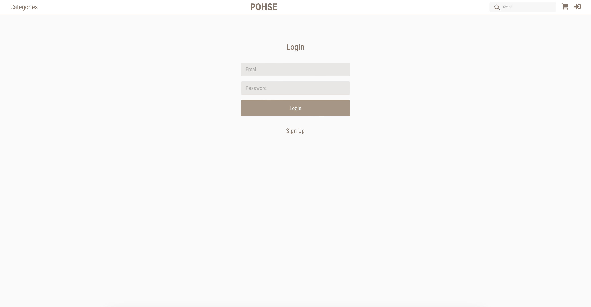

# eCommerce Web Application

This project is a comprehensive eCommerce web application built using [React](https://reactjs.org/) and bootstrapped with [Create React App](https://create-react-app.dev/). Package management is handled by [Yarn](https://yarnpkg.com/).

## Overview 

Our eCommerce application provides a seamless shopping experience. Users can browse products, add them to their cart, and complete purchases. 

## Features

- User authentication and profile management
- Browse products by category
- Add products to shopping cart and manage the cart
- Checkout and payment integration
- Responsive design, works on mobile and desktop browsers

## Screenshots

Here are more screenshots of the application:

## Getting Started

To get a local copy up and running follow these simple steps.

### Prerequisites

- [Node.js](https://nodejs.org/en/)
- [Yarn](https://yarnpkg.com/)

### Installation

1. Clone the repo:  
   `git clone https://github.com/rokasandreikenas/ecommerce.git`

2. Install Yarn packages:  
   `yarn install`

3. Start the server:  
   `yarn start`

You can now view the application running at `localhost:3000` in your browser.

## Built With

- [React](https://reactjs.org/)
- [Create React App](https://create-react-app.dev/)
- [Yarn](https://yarnpkg.com/)

## Contributing

We welcome any contributions you make.

1. Fork the Project
2. Create your Feature Branch (`git checkout -b feature/AmazingFeature`)
3. Commit your Changes (`git commit -m 'Add some AmazingFeature'`)
4. Push to the Branch (`git push origin feature/AmazingFeature`)
5. Open a Pull Request
